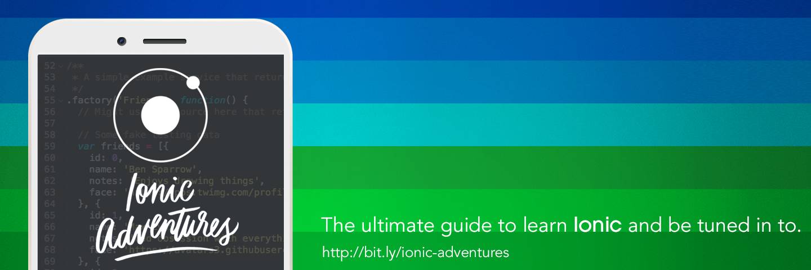

# Ionic Adventures
The ultimate guide to learn [Ionic](http://ionicframework.com) and be tuned in to.
Free and open source, Ionic SDK offers a library of mobile-optimized HTML, CSS and JS components, gestures, and tools for building highly interactive apps. Built with Sass and optimized for AngularJS.

## Topics at a glance

 1. [Getting Started](#getting-started)
 2. [Presentations](#presentations)
 3. [Articles](#articles)
 4. [Books](#books)
 5. [Videos](#videos)
 6. [Workshops & Courses](#workshops--courses)
 7. [Events](#events)
 8. [Meetups](#meetups)
 9. [Tools](#tools)
 10. [Open Source](#open-source)
 11. [Build with Ionic](#build-with-ionic)
 12. [Jobs](#jobs)

## Getting Started

The best resource to get start with Ionic Framework is follow the [Getting Started](http://ionicframework.com/getting-started/) guide into Ionic Framework website and also watch the [Ionic Crash Course](https://www.youtube.com/watch?v=C-UwOWB9Io4) created by [Max Lynch](https://twitter.com/maxlynch) where he shows all initial steps to create amazing apps.

## Presentations

We already have nice presentations about Ionic, what about create your own? [Start your presentation here](http://ionicframework.com/present-ionic/) :star:

* [Ionic + Angular: Superpowers for Mobile App Development](http://adamdbradley.github.io/ionic-present/#/) by [@adamdbradley](https://twitter.com/adamdbradley) at [ng-conf 2015](http://www.ng-conf.org/)
* [Reframing Hybrid](http://www.slideshare.net/BenSperry/reframing-hybrid-48859060) by @maxlynch & @benjsperry
* [Work better and smarter with Ionic](http://mikehartington.com/ionic-san-francisco/) by @mhartington
* [Hybrid mobile apps with Ionic & Firebase](https://sf-ionic-pres.firebaseapp.com/) by @srobtweets
* [Ionic Crash Course! Hack-a-ton SF](http://www.slideshare.net/simpul/ionic-hackaton) by @simpulton
* [Ionic Adventures - Hybrid Mobile Development Rocks](http://www.slideshare.net/juarezpaf/ionic-adventures-hybrid-mobile-development-rocks) by @juarezpaf
* [Creating an hybrid app in minutes with Ionic Framework](http://www.slideshare.net/julienrenaux/hybrid-apps-withionic) by @julienrenaux
* [Cordova, Angularjs & Ionic](http://www.slideshare.net/EddieLau1/cordova-angularjs-ionic-codeaholics) by @tatonlto
* [Cross Platform Mobile Apps with the Ionic Framework](http://slideshare.net/rockncoder/rocking-the-ionic-framework) by @therockncoder
* [Building Mobile Apps with Cordova , AngularJS and Ionic](http://slideshare.net/kadhemdevtunisie/building-mobile-apps-with-cordova-angularjs-and-ionic) by @kadhem_soltani
* [Building Mobile Applications with Ionic](http://www.slideshare.net/morrissinger/building-mobile-applications-with-ionic) by @morrissinger
* [Rapid Mobile apps with Ionic](http://ionic-presentation.techgirlwonder.com/#/) by @techgirlwonder
* [Hybrid Apps with Angular & Ionic Framework](http://www.slideshare.net/cihadhoruzoglu/hybrid-apps-with-angular-ionic-framework) by @cihadhoruzoglu
* [Ionic Framework](http://www.slideshare.net/dylanswartz/ionic-slidedeck) by @dylan_swartz
* [Ionic CLI adventures](http://pt.slideshare.net/juarezpaf/ionicadventures-ioniccli) by @juarezpaf
* [Ionic Framework: The excuses are over to start to create amazing apps](http://matheuscas.github.io/ionic-present/) by @matheuscas
* [Ionic: The Web SDK for Develop Mobile Apps](http://www.slideshare.net/matheusmcas/ionic-the-web-sdk-for-develop-mobile-apps) by @matheuscas

## Articles
Do you want to become an expert with Ionic? What about start looking into [learnionic](http://learn.ionicframework.com/) section in the Ionic website.

Now we have a bunch of articles to get you covered in many topics related to Ionic and Mobile Development:
Scrolling too much? Check out [Ionic Collection](http://thompsonemerson.github.io/ionic-collection) for a built-in search/filter feature.

##### Analytics
- [How to use Custom Events in Ionic Analytics](https://www.youtube.com/watch?v=5p_lZm6OCmc) by @creatorup

##### Angular 2
- [WTF is ES6/TypeScript/AtScript/Babel?](http://learnangular2.com/es6) by @ionicframework
- [Ionic and Angular 2](http://blog.ionic.io/angular-2-ionic) by @maxlynch
- [What Impact Will AngularJS 2.0 Have on Ionic?](http://www.joshmorony.com/what-impact-will-angularjs-2-0-have-on-ionic) by @joshuamorony
- [Intro to ECMAScript 6 and Angular 2 for Ionic Developers](http://www.joshmorony.com/intro-to-ecmascript-6-and-angular-2-for-ionic-developers/) by @joshuamorony

##### AngularJS
- [Overriding a Directive in AngularJS](https://calendee.com/2015/08/03/overriding-a-directive-in-angularjs) by @Calendee `new`
- [Better Resource Mapping with Ionic and AngularJS](https://medium.com/philosophie-is-thinking/better-resource-mapping-with-ionic-and-angularjs-37dcbdbcd3e4) by @ Russell Wolf `new`
- [Environment Variables](http://geekindulgence.com/environment-variables-in-angularjs-and-ionic/) by @jeff_french

##### Audio
- [Using the Web Audio API for precision audio in Ionic](http://airpa.ir/1QScdnq) by @dsabar

##### Authentication
- [Cookie-based Authentication in AngularJS](http://blog.ionic.io/angularjs-authentication) by @maxlynch
- [Handle User Sign-In With IonicFramework](https://www.thepolyglotdeveloper.com/2014/07/handle-user-sign-ionicframework) by @nraboy
- [Simple login example with ionic and AngularJS](http://devdactic.com/simple-login-example-with-ionic-and-angularjs) by @schlimmson
- [How To Handle User Authentication With AngularJS Inside Your Ionic App](http://devdactic.com/user-auth-angularjs-ionic) by @schlimmson

##### Azure Mobile Services
- [Build a Hybrid Application with the Ionic Framework and Azure Mobile Services, Part 1: Configuring the Project](http://briantroncone.com/?p=315) by @btroncone
- [Build a Hybrid Application with the Ionic Framework and Azure Mobile Services, Part 2: Creating the User Interface](http://briantroncone.com/?p=365) by @btroncone
- [Build a Hybrid Application with the Ionic Framework and Azure Mobile Services, Part 3: Wiring Up The Backend](http://briantroncone.com/?p=391) by @btroncone
- [Hybrid Application development with Ionic  and Azure Mobile Services](https://acaseyblog.wordpress.com/2015/10/07/build-a-hybrid-application-with-the-ionic-framework-and-windows-azure-mobile-services/) by @AIDANJCASEY

##### Basics
- [Ionic Framework FTW!](https://www.airpair.com/ionic-framework/posts/ionic-framework-ftw) by @agustinhaller
- [Help Us Help You – How To Ask a Good Ionic Forum Question](http://www.gajotres.net/help-us-help-you-how-to-ask-a-good-ionic-forum-question) by @gajotres
- [Ionic Framework | Using Touch Gestures](http://www.gajotres.net/ionic-framework-series-13-touch-gestures) by @gajotres
- [Ionic Framework | Working With Forms And Validation](http://www.gajotres.net/ionic-framework-tutorial-10-form-handling-and-validation) by @gajotres
- [Ionic Framework | Using Grid System](http://www.gajotres.net/ionic-framework-series-14-grid-system) by @gajotres
- [Ionic Framework | Using Page Navigation](http://www.gajotres.net/ionic-framework-tutorial-8-page-navigation) by @gajotres
- [Ionic Framework | How To Pass Data Between Pages](http://www.gajotres.net/ionic-framework-tutorial-9-passing-data-between-pages) by @gajotres
- [Ionic Framework | Get Page Height & Width](http://www.gajotres.net/ionic-framework-get-page-height-width) by @gajotres
- [Understanding Ionic View LifeCycle](http://www.gajotres.net/understanding-ionic-view-lifecycle) by @gajotres
- [Using Views Events To Create JavaScript Pure Ionic Splash Screen](http://www.gajotres.net/using-views-events-to-create-javascript-pure-ionic-splash-screen) by @gajotres
- [How To Add A Search Bar In The Header On Ionic](http://gonehybrid.com/how-to-add-a-search-bar-in-the-header-on-ionic) by @ashteya
- [How To Organize The Files In Your Ionic Project](http://gonehybrid.com/how-to-organize-the-files-in-your-ionic-project) by @ashteya
- [How To Group Items In Ionic's Collection-Repeat](http://gonehybrid.com/how-to-group-items-in-ionics-collection-repeat) by @ashteya

##### CLI
- [How to Create Splashscreens and Icons with Ionic](https://github.com/shprink/wordpress-hybrid-client/blob/develop/SPLASHICONS.md) by @julienrenaux `new`
- [Solving the pesky “EMFILE: Too many opened files” in Ionic / AngularJs — and a lesson in humility](https://medium.com/@dotfrank/solving-the-pesky-emfile-too-many-opened-files-in-ionic-angularjs-46b15dbc35eb) by @dotfrank `new`
- [Build Native installers using Ionic CLI from your terminal/prompt](http://thejackalofjavascript.com/build-native-installers-using-ionic-cli) by @arvindr21
- [The three most useful Ionic CLI features I use on a daily basis](http://www.intridea.com/blog/2015/5/19/the-ionic-cli) by @withinsight
- [Ionic adds a new State feature](http://www.raymondcamden.com/2015/04/20/ionic-adds-a-new-state-feature) by @raymondcamden
- [Example of Ionic’s Updating Feature](http://www.raymondcamden.com/2015/03/11/example-of-ionics-updating-feature) by @raymondcamden
- [Debugging AngularJS Apps from the Console](http://blog.ionic.io/angularjs-console) by @maxlynch
- [Automatically Generate Icons and Splash Screens for PhoneGap Apps](http://www.joshmorony.com/automatically-generate-icons-and-splash-screens-for-phonegap-apps) by @joshuamorony

##### Comparison
- [The Top 7 Hybrid Mobile App Frameworks](http://www.sitepoint.com/top-7-hybrid-mobile-app-frameworks/) by @jay3dec
- [Hybrid UI framework shootout: Ionic vs. Famo.us vs. F7 vs. OnsenUI](https://www.airpair.com/ionic-framework/posts/hybrid-apps-ionic-famous-f7-onsen) by gleichger.com
- [Why Ionic is Reigniting the Native vs HTML5 Debate](http://blog.teamtreehouse.com/ionic-reigniting-native-vs-html5-debate) by @chalkers

##### Components
- [Ionic Framework Tabs: Go to Home View](http://www.clearlyinnovative.com/ionic-framework-tabs-go-home-view) by @C_Innovative
- [Understanding Ionic's Side Menu](http://mcgivery.com/understanding-ionics-side-menu) by @andrewmcgivery
- [Understanding Tabs in Ionic Framework](https://www.thepolyglotdeveloper.com/2014/12/understanding-tabs-ionic-framework) by @nraboy
- [Understanding the Ionic Framework Action Sheet](http://mcgivery.com/understanding-ionic-framework-action-sheet) by @andrewmcgivery
- [Make List Items Swipeable in Ionic Framework](https://www.thepolyglotdeveloper.com/2014/12/make-list-items-swipeable-ionic-framework) by @nraboy
- [Using Slide Boxes and Tabs in Ionic Framework Apps](https://www.thepolyglotdeveloper.com/2014/11/using-slide-boxes-tabs-ionic-framework-apps) by @nraboy

##### Cordova & ngCordova
- [The Complete Guide To Images With Ionic](http://devdactic.com/complete-image-guide-ionic) by @schlimmson `new`
- [Add Touch ID Authentication To Your Ionic Framework App](https://www.thepolyglotdeveloper.com/2015/08/add-touch-id-authentication-to-your-ionic-framework-app) by @nraboy `new`
- [Modify The Badge Number Of An Ionic Framework App](https://www.thepolyglotdeveloper.com/2015/07/modify-the-badge-number-of-an-ionic-framework-app) by @nraboy `new`
- [Using A Pin Dialog In Your Ionic Framework Mobile App](https://www.thepolyglotdeveloper.com/2015/07/using-a-pin-dialog-in-your-ionic-framework-mobile-app) by @nraboy `new`
- [Cordova/Ionic Sample App: My Sound Board](http://www.raymondcamden.com/2015/07/30/cordovaionic-sample-app-my-sound-board) => [Source code](https://github.com/cfjedimaster/Cordova-Examples/tree/master/mysoundboard) by @raymondcamden `new`
- [Using Wizcorp’s phonegap-facebook-plugin + ionic for NATIVE SSO in iOS](https://medium.com/@giltamari/using-wizcorps-phonegap-facebook-plugin-ionic-for-native-sso-in-ios-ca30aa13e419) by Gil Tamari `new`
- [How to Launch External Application With Ionic Framework](http://www.gajotres.net/how-to-launch-external-application-with-ionic-framework) by @gajotres
- [Getting Started with ngCordova](http://thejackalofjavascript.com/getting-started-with-ngcordova) by @arvindr21
- [Ionic Framework Custom Formly Template using DatePicker Plugin](http://www.clearlyinnovative.com/ionic-framework-custom-formly-template-using-datepicker-plugin) => [Source code](https://github.com/aaronksaunders/ionic-formly-demo) by @C_Innovative
- [Changing & Locking Screen Orientation In Ionic Application](http://www.gajotres.net/changing-locking-screen-orientation-in-ionic-application) by @gajotres
- [Using Smartphone Camera With Ionic Framework](http://www.gajotres.net/using-smartphone-camera-with-ionic-framework) by @gajotres
- [Whitelist External Resources and API Calls | Ionic Framework](http://www.gajotres.net/whitelist-external-resources-and-api-calls-ionic-framework) by @gajotres
- [Using Cordova Geoloacation API with Google Maps in Ionic Framework](http://www.gajotres.net/using-cordova-geoloacation-api-with-google-maps-in-ionic-framework) by @gajotres
- [Ionic Framework, Cordova and File API – A Media Player App](http://thejackalofjavascript.com/ionic-framework-cordova-and-file-api-a-media-player-app) by @arvindr21
- [Useful Cordova Plugins For Your Ionic Application & Examples](http://www.gajotres.net/useful-cordova-plugins-for-your-ionic-application-examples) by @gajotres
- [Don't Assume localStorage Will Always Work In Your Hybrid App](http://gonehybrid.com/dont-assume-localstorage-will-always-work-in-your-hybrid-app) by @ashteya
- [Monitor Device Battery Status Using Ionic Framework](https://www.thepolyglotdeveloper.com/2015/07/monitor-device-battery-status-using-ionic-framework) by @nraboy
- [An update to my RSS Reader built with Ionic](http://www.raymondcamden.com/2015/06/22/an-update-to-my-rss-reader-built-with-ionic) by @raymondcamden
- [Create A File Browser Using Ionic Framework](http://airpa.ir/1M7Ee3z) by @nraboy
- [Getting Started with Ionic & ngCordova](http://justinrodenbostel.com/2015/02/04/getting-started-with-ionic-ngcordova) by @revdrjrr
- [Make A Gallery-Like Image Grid Using Ionic Framework](https://www.thepolyglotdeveloper.com/2015/03/make-a-gallery-like-image-grid-using-ionic-framework) by @nraboy
- [Crafting a weather app with Ionic framework and Forecast.io](http://www.binpress.com/tutorial/a-simple-weather-forecast-app-with-ionic-framework-and-forecastio/107) by Sriram Kota
- [Minifying Your App’s Source Code](http://blog.ionic.io/minifying-your-source-code) by @nraboy
- [Store Camera Photos Permanently Using PhoneGap, Ionic & ngCordova](http://www.joshmorony.com/store-camera-photos-permanently-using-phonegap-ionic-ngcordova) by @joshuamorony
- [Whitelist External Resources For Use In Ionic Framework](https://www.thepolyglotdeveloper.com/2015/05/whitelist-external-resources-for-use-in-ionic-framework/) by @nraboy

##### Couchbase
- [Using Couchbase in Your Ionic Framework Application Part 2](http://blog.couchbase.com/using-couchbase-in-your-ionic-framework-application-part-2) by @nraboy `new`
- [Using Couchbase in Your Ionic Framework Application Part 1](http://blog.couchbase.com/using-couchbase-in-your-ionic-framework-application-part-1) by @nraboy

##### Crosswalk
- [Getting started with Crosswalk in Ionic](http://www.thomasmaximini.com/2015/01/23/getting-started-with-crosswalk-in-ionic.html) by @tmaximini
- [Use The Ionic CLI To Integrate Crosswalk Into Your Project](https://www.thepolyglotdeveloper.com/2015/02/use-ionic-cli-integrate-crosswalk-project) by @nraboy
- [How to automatically sign your Android apk using Ionic framework and Crosswalk](https://baxeico.wordpress.com/2015/05/20/how-to-automatically-sign-your-android-apk-using-ionic-framework-and-crosswalk) by @baxeico
- [Using the Crosswalk Project Runtime in Shared Mode](https://crosswalk-project.org/blog/crosswalk-shared-mode.html) by @il_bale
- [Boost your Cordova app performance with Crosswalk](http://geeklearning.io/boost-your-ionic-app-performance/) by @geek_learning

##### Customize
- [Deep linking in Ionic Mobile Applications](https://medium.com/angularjs-articles/deep-linking-in-ionic-mobile-applications-44d8b4685bb3) by @wedgybo `new`
- [Add Pin Code Unlock To Your IonicFramework App](https://www.thepolyglotdeveloper.com/2014/09/add-pin-code-unlock-ionicframework-app) by @nraboy
- [Embed Video In Your iOS And Android Ionic Framework App](https://www.thepolyglotdeveloper.com/2015/01/embed-video-ios-android-ionicframework-app) by @nraboy
- [Adding Background Images To Ionic Framework Apps](https://www.thepolyglotdeveloper.com/2015/04/adding-background-images-to-ionic-framework-apps) by @nraboy
- [Animations For Your Ionic App with Move.js](http://devdactic.com/ionic-with-movejs) by @schlimmson
- [How to Create Complex Layouts in Ionic](http://www.joshmorony.com/how-to-create-complex-layouts-in-ionic) by @joshuamorony
- [Using Sass in Your Ionic Framework App Like a Pro](https://www.codementor.io/angularjs/tutorial/how-to-use-sass-in-ionic-framework-like-a-pro) by @CodementorIO

##### Debugging
- [How To Debug The White Screen Of Death In Your Ionic App](http://gonehybrid.com/how-to-debug-the-white-screen-of-death-in-your-ionic-app) by @ashteya
- [Debugging Ionic Apps using Chrome Developer Tools](http://mcgivery.com/debugging-ionic-apps-chrome-developer-tools/) by @andrewmcgivery
- [Apache Cordova and remote debugging on iOS](http://geeklearning.io/apache-cordova-and-remote-debugging-on-ios/) by @geek_learning
- [Apache Cordova and remote debugging on Android](http://geeklearning.io/apache-cordova-and-remote-debugging-on-android/) by @geek_learning

##### Drupal
- [Building native mobile apps with Ionic and Drupal #1](http://www.blinkreaction.com/blog/building-native-apps-part-1) => Part [#2](http://www.blinkreaction.com/blog/building-native-apps-part-2), [#3](http://www.blinkreaction.com/blog/building-native-apps-part-3), [#4](http://www.blinkreaction.com/blog/building-native-apps-part-4), [#5](http://www.blinkreaction.com/blog/building-native-apps-part-5) and [#6](http://www.blinkreaction.com/blog/building-native-apps-part-6) by @FFWdev

##### Dropbox
- [Syncing Data With Dropbox Using Ionic Framework](https://www.thepolyglotdeveloper.com/2014/10/syncing-data-dropbox-using-ionicframework) by @nraboy

##### Electron (atom shell)
- [Some initial thoughts on building desktop apps with Ionic and Electron](http://www.raymondcamden.com/2015/07/23/some-initial-thoughts-on-building-desktop-apps-with-ionic-and-electron) by @raymondcamden

##### Emulation
- [Ionic - Using Android x86 Virtual Machine Instead of Emulator](http://digitaldrummerj.me/Android-x86-Virtual-Machine-Instead-Of-Emulator) by @digitaldrummerj

##### ES6
- [ES6 — Let’s talk about ECMAScript 2015](https://medium.com/ecmascript-2015/let-s-talk-about-javascript-ecmascript-2015-es6-say-hello-world-658ce6941c) by @mrzepinski `new`
- [How to use JavaScript 2015 (ES6) now in your Ionic app](http://labs.encoded.io/2015/06/22/use-es6-with-ionic/) by @mirkonasato

##### Firebase & External Requests
- [Adding Social Login with Firebase](http://blog.ionic.io/adding-social-login-with-firebase/) by @mhartington `new`
- [Cross platform apps using Ionic, Electron, AngularJS and Firebase with shared codebase — Chapter 1 — Part 1 (Project: LEAN)](https://medium.com/@kaumac/cross-platform-apps-using-ionic-electron-angularjs-and-firebase-with-shared-codebase-chapter-1-52859cc6d742) by @kaumac `new`
- [Making an Ionic Hybrid Mobile Application with Angular.js and Firebase](https://medium.com/@edoziizegbu/making-an-ionic-hybrid-mobile-application-with-html-css-and-js-361381fafad4) by Edozié Izegbu `new`
- [Ionic & Firebase starter codelab](https://docs.google.com/document/d/1XgtPqprwEFHDff4MOfZKs9lc-KS_G02FhGJMbt6Kp74/view) by @GDGKansasCity
- [Node Webkit, Firebase and Ionic Framework – A one to one chat client](http://thejackalofjavascript.com/one-to-one-chat-client) by @arvindr21
- [A guide to design and develop a multi-tenant, secure and real time solution](https://www.airpair.com/firebase/posts/yatodo-guide) by @ksachdeva
- [Using Ionic with Firebase](https://www.firebase.com/docs/web/libraries/ionic/guide.html) by @Firebase
- [Ionic, AngularJS and Firebase equals Hybrid Heaven](http://blog.budacode.com/2015/06/09/ionic-angularjs-and-firebase-equals-hybrid-heaven/) by @martzellk
- [Building Real-Time, Multi-Platform Mobile Applications: Examples Using Ionic and Firebase](http://toptal.com/front-end/building-multi-platform-real-time-mobile-applications-using-ionic-framework-and-firebase) by Avinash Kaza
- [Creating a Bucket List with the Ionic Framework and Firebase](http://www.sitepoint.com/creating-bucket-list-ionic-framework-firebase) by @jay3dec
- [Create a Password Management App using Ionic and Firebase](http://airpa.ir/1zJD2wL) by @nraboy
- [Real Time Synced Slides using Ionic, Firebase and AngularJS](http://ng-learn.org/2014/07/Project_Synces_Slides/) by @sesteva
- [Upload Camera Images To Firebase Using Ionic Framework](https://www.airpair.com/ionic-framework/posts/ionic-firebase-camera-app) by @nraboy
- [Sign Into Firebase With Facebook Using Ionic Framework](https://www.thepolyglotdeveloper.com/2015/03/sign-into-firebase-with-facebook-using-ionic-framework/) by @nraboy
- [Creating a Firebase Powered End to End Ionic Application](http://www.sitepoint.com/creating-firebase-powered-end-end-ionic-application/) by @arvindr21
- [Syncing Data With Firebase Using Ionic Framework](https://www.thepolyglotdeveloper.com/2014/12/syncing-data-firebase-using-ionic-framework) by @nraboy
- [Create a Password Management App Using Ionic Framework and Firebase](https://www.airpair.com/ionic-framework/posts/ionic-firebase-password-manager) by @nraboy
- [Ionic: Using Factories and Web Services for Dynamic Data](http://mcgivery.com/ionic-using-factories-and-web-services-for-dynamic-data) by @andrewmcgivery
- [SOAP Web Services in Angular and Ionic](http://mcgivery.com/soap-web-services-angular-ionic) by @andrewmcgivery
- [Make HTTP Requests In Android And iOS With IonicFramework](https://www.thepolyglotdeveloper.com/2014/08/make-http-requests-android-ios-ionicframework) by @nraboy

##### Firefox OS
- [Create an app Firefox OS](https://medium.com/dev-rocket/create-an-app-firefox-os-da777dfffcac) by @yrezgui `new`
- [Firefox OS Game Development with the Ionic Framework](http://www.sitepoint.com/firefox-os-game-development-ionic-framework/) by @aziflaj
- [Firefox OS Game Development with the Ionic Framework - Part 2](http://www.sitepoint.com/firefox-os-game-development-ionic-framework-part-2/) by @aziflaj

##### Gallery
- [How To Create An Advanced Ionic Gallery with Image Zooming](http://devdactic.com/ionic-image-zooming) by @schlimmson

##### Game
- [Adding Gamecenter Support to your Ionic App](http://devdactic.com/gamecenter-ionic/) by @schlimmson

##### Getting started
- :zap: [Introduction to Ionic with Developer Perry Govier](https://www.codementor.io/javascript/tutorial/what-is-ionic-framework-perry-govier) by @perrygovier `new`
- [Getting Started with Ionic Framework](https://medium.com/ionic-tnt/getting-started-with-ionic-framework-91fc51a997c8) by @denzildoyle `new`
- [Switching from native iOS to Ionic: Why Hybrid doesn't suck (anymore)](https://www.airpair.com/javascript/posts/switching-from-ios-to-ionic) by @schlimmson
- [Hello World: Your First Ionic Framework App](http://mcgivery.com/hello-world-first-ionic-framework-app) by @andrewmcgivery
- [A Comprehensive List Of Ionic Starter Apps](http://www.gajotres.net/a-comprehensive-list-of-ionic-starter-apps) by @gajotres
- [Inspect Your Ionic App With ng-inspector](http://gonehybrid.com/inspect-your-ionic-app-with-ng-inspector) by @ashteya
- [Ionic Framework, Cordova and Yeoman – Loved One Notifier](http://thejackalofjavascript.com/lon) by @arvindr21
- [Ionic Framework | Installation Guide](http://www.gajotres.net/ionic-framework-tutorial-1-installation) by @gajotres
- [Ionic Framework |An anatomy of a page](http://www.gajotres.net/ionic-framework-tutorial-2-anathomy-of-a-page) by @gajotres
- [From Mobile Ideation to Launch Using Ionic Framework](http://www.clearlyinnovative.com/mobile-ideation-to-launch-ionic) by @C_Innovative
- [Getting Started with Ionic](http://blog.teamtreehouse.com/getting-started-ionic) by @chalkers
- :zap: [The Definitive Ionic Starter Guide](https://www.airpair.com/ionic-framework/posts/the-definitive-ionic-starter-guide) by @gnomeontherun
- [Intimate with Ionic: #1. Getting started](http://www.davethedev.co.uk/2015/06/14/intimate-with-ionic-1-getting-started/) => Part [#2](http://www.davethedev.co.uk/2015/06/17/intimate-with-ionic-2-ionic-io-and-the-cli/), [#3](http://www.davethedev.co.uk/2015/06/21/intimate-with-ionic-3-lets-get-building/) and [#4](http://www.davethedev.co.uk/2015/06/28/intimate-with-ionic-4-setup-for-android/) by @davethedev92
- [Mobile Hybrid Apps with VS Code and Ionic](http://blogs.msdn.com/b/vscode/archive/2015/06/05/mobile-hybrid-apps-with-vs-code-and-ionic.aspx) by @chrisdias
- [Mastering the Ionic Framework: Learn to Build & Deploy Native Speed HTML5 Based Apps](https://thinkster.io/ionic-framework-tutorial/) by @ericsimons40
- [Ionic Tutorial](https://ccoenraets.github.io/ionic-tutorial) by @ccoenraets
- [Getting Started Building Mobile Apps with the Ionic Framework](http://java.dzone.com/articles/getting-started-building-0) by @therockncoder
- [Building a Simple App Using Ionic, an Advanced Mobile App Framework](http://www.sitepoint.com/building-simple-app-using-ionic-advanced-html5-mobile-app-framework) by @jay3dec
- [5 Ionic Framework App Development Tips and Tricks](http://www.sitepoint.com/5-ionic-app-development-tips-tricks) by @thatpatrickguy
- [Structure of an Ionic App](http://mcgivery.com/structure-of-an-ionic-app) by @andrewmcgivery
- [Creating Views with Ionic](http://mcgivery.com/creating-views-with-ionic) by @andrewmcgivery
- [Controllers in Ionic/Angular](http://mcgivery.com/controllers-ionicangular) by @andrewmcgivery
- [Modules in Ionic/Angular](http://mcgivery.com/modules-ionicangular) by @andrewmcgivery
- [Using The UI-Router To Navigate In Ionic Framework](https://www.thepolyglotdeveloper.com/2014/11/using-ui-router-navigate-ionicframework) by @nraboy
- [Organising Code in an Ionic Application for Beginners](http://www.joshmorony.com/organising-code-in-an-ionic-application-for-beginners) by @joshuamorony
- [Validation in Ionic Framework Apps with ngMessages](https://calendee.com/2014/12/26/validation-in-ionic-framework-apps-with-ngmessages) by @calendee
- [Learning the Ionic Framework as a Sencha Touch Developer: Part 1](http://www.joshmorony.com/learning-the-ionic-framework-as-a-sencha-touch-developer-part-1) => [#2](http://www.joshmorony.com/learning-the-ionic-framework-as-a-sencha-touch-developer-part-2), [#3](http://www.joshmorony.com/learning-the-ionic-framework-as-a-sencha-touch-developer-part-3), [#4](http://www.joshmorony.com/learning-the-ionic-framework-as-a-sencha-touch-developer-part-4), [#5](http://www.joshmorony.com/learning-the-ionic-framework-as-a-sencha-touch-developer-part-5) by @joshuamorony
- [Build Your First Mobile App With The Ionic Framework - Part 1 - Introduction to Hybrid Mobile Apps](http://gonehybrid.com/build-your-first-mobile-app-with-the-ionic-framework-part-1/) by @ashteya
- [Build Your First Mobile App With The Ionic Framework - Part 2 - Set Up your Development Environment](http://gonehybrid.com/build-your-first-mobile-app-with-the-ionic-framework-part-2/) by @ashteya
- [Build Your First Mobile App With The Ionic Framework - Part 3 - Mockup with Ionic Creator](http://gonehybrid.com/build-your-first-mobile-app-with-the-ionic-framework-part-3/) by @ashteya
- [Build Your First Mobile App With The Ionic Framework - Part 4 - Test on Browsers, Emulators and Mobile Devices](http://gonehybrid.com/build-your-first-mobile-app-with-the-ionic-framework-part-4/) by @ashteya
- [Build Your First Mobile App With The Ionic Framework - Part 5 - Build out the App](http://gonehybrid.com/build-your-first-mobile-app-with-the-ionic-framework-part-5/) by @ashteya
- [Build Your First Mobile App With The Ionic Framework - Part 6 - Deploy to Testers with Ionic View](http://gonehybrid.com/build-your-first-mobile-app-with-the-ionic-framework-part-6/) by @ashteya

##### Google Maps
- [Using Google Maps With Ionic Framework](http://www.gajotres.net/using-google-maps-with-ionic-framework) by @gajotres

##### Grunt
- [Start an App with Ionic + Bower + Grunt](https://medium.com/@jclalala/start-an-app-with-ionic-grunt-bower-97469ae8750d) by Jeffrey Chang `new`
- [Using the Ionic Framework with Grunt and PhoneGap Build](http://mcgivery.com/using-the-ionic-framework-with-grunt-and-phone-gap-build) by @andrewmcgivery
- [How to Minify an Ionic Application for Production](http://www.joshmorony.com/how-to-minify-an-ionic-application-for-production) by @joshuamorony

##### Gulp
- [Production ready apps with Ionic Framework](https://www.airpair.com/ionic-framework/posts/production-ready-apps-with-ionic-framework#2MjmJxILD08BgHRP.01) by @agustinhaller
- [Speeding up Ionic app development with gulp](http://www.thomasmaximini.com/2015/02/10/speeding-up-ionic-app-development-with-gulp.html) by @tmaximini
- [Automatically Add JS/CSS Files to Your Ionic Projects](http://digitaldrummerj.me/gulp-inject) by @digitaldrummerj

##### IBM MobileFirst & Bluemix
- [SauceDB: Writing data back](http://www.raymondcamden.com/2015/07/29/saucedb-writing-data-back) by @raymondcamden `new`
- [SauceDB – Building the back end with IBM Bluemix](http://www.raymondcamden.com/2015/07/20/saucedb-building-the-back-end-with-ibm-bluemix) by @raymondcamden
- [SauceDB – Working on the front end](http://www.raymondcamden.com/2015/07/15/saucedb-working-on-the-front-end) by @raymondcamden
- [New Demo Project: SauceDB](http://www.raymondcamden.com/2015/07/14/new-demo-project-saucedb) by @raymondcamden
- [Building Hybrid Mobile apps with Cordova & Ionic and Mobile Backend-as-a-Service (MBaaS) with IBM Bluemix](https://deskinhursley.wordpress.com/2015/07/03/building-hybrid-mobile-apps-with-cordova-ionic-and-mobile-backend-as-a-service-mbaas-with-ibm-bluemix) by @BenM4nn
- [Working with Ionic, Box, and IBM MobileFirst](http://www.raymondcamden.com/2015/06/24/working-with-ionic-box-and-ibm-mobilefirst) by @raymondcamden
- [Working with IBM MobileFirst and the Ionic Framework](http://www.raymondcamden.com/2015/03/23/working-with-ibm-mobilefirst-and-the-ionic-framework) by @raymondcamden
- [Using MobileFirst HTTP Adapters with an Ionic Application](http://www.raymondcamden.com/2015/04/08/using-mobilefirst-http-adapters-with-an-ionic-application) by @raymondcamden
- [Using MobileFirst SQL Adapters with an Ionic Application](http://www.raymondcamden.com/2015/04/02/using-mobilefirst-sql-adapters-with-an-ionic-application) by @raymondcamden
- [Using Remote Logging with Ionic and IBM MobileFirst](http://www.raymondcamden.com/2015/03/31/using-remote-logging-with-ionic-and-ibm-mobilefirst) by @raymondcamden
- [Working with IBM MobileFirst and Ionic – Bootstrapping](http://www.raymondcamden.com/2015/03/24/working-with-ibm-mobilefirst-and-ionic-bootstraping) by @raymondcamden

##### Infinite Scroll
- [Creating a Feed in Ionic](http://mcgivery.com/creating-feed-ionic) by @andrewmcgivery
- [Ionic Framework | Using Infinite Scroll](http://www.gajotres.net/ionic-framework-tutorial-11-infinite-scroll) by @gajotres
- [Ionic's Infinite Scrol](http://mcgivery.com/ionic-infinite-scroll) by @andrewmcgivery

##### Internationalization
- [Internationalization of an Ionic App: Multilanguage Support](http://mcgivery.com/internationalization-of-an-ionic-app-multilanguage-support) by @andrewmcgivery
- [Internationalization and Localization with Ionic Framework and Angular Translate](https://www.thepolyglotdeveloper.com/2014/08/internationalization-localization-ionicframework-angular-translate) by @nraboy

##### Meteor
- [Meteor-React-Ionic Mobile App Part 1](https://medium.com/@SamCorcos/meteor-react-ionic-mobile-app-part-1-the-basic-template-9355ebf3397f) => Part [#2](https://medium.com/@SamCorcos/meteor-react-ionic-mobile-app-part-2-passing-in-data-a0478b17a53d), [#3](https://medium.com/@SamCorcos/meteor-react-ionic-mobile-app-part-3-tabs-and-modals-9d26f51c59ff),
[#4.1](https://medium.com/@SamCorcos/meteor-react-ionic-mobile-app-part-4-1-users-and-settings-4fd3950b829f),
[#4.2](https://medium.com/@SamCorcos/meteor-react-ionic-mobile-app-part-4-2-users-and-settings-6c87832470a5),
[#4.3](https://medium.com/@SamCorcos/meteor-react-ionic-mobile-app-part-4-3-users-and-settings-3ecc171bfa5c) by @SamCorcos

##### MongoDB
- [Ionic Restify MongoDB – An End to End Hybrid App](http://thejackalofjavascript.com/an-end-to-end-hybrid-app) by @arvindr21

##### Node.js & Socket.io
- [Ionic, Twilio and Node Scheduler – A Reminder App – Part I](http://thejackalofjavascript.com/ionic-twilio-and-node-scheduler-part-1) => Part [#2](http://thejackalofjavascript.com/ionic-twilio-and-node-scheduler-part-2) by @arvindr21
- [Twilio, Ionic Framework and Node.js – A Message & Call App](http://thejackalofjavascript.com/twilio-ionic-framework-and-node-js-a-message-call-app) by @arvindr21
- [Ionic SocketIo Chat Application Tutorial](https://www.airpair.com/ionic-framework/posts/ionic-socketio-chat-application-tutorial) by @melvinphilips8

##### Parse
- [Building a remote backend for an Ionic framework app with Parse](https://www.binpress.com/tutorial/building-a-remote-backend-for-an-ionic-framework-app-with-parse/116) by @binpress `new`
- [Starter Ionic Application Template w/Parse Integration](http://www.clearlyinnovative.com/starter-ionic-application-template-wparse-integration) => [Source code](https://github.com/aaronksaunders/parse-starter-ionic) by @C_Innovative
- [Ionic Framework & Facebook Login with Parse](http://www.clearlyinnovative.com/ionic-framework-facebook-login-with-parse) by @C_Innovative
- [Ionic Framework - Camera Image Uploads and Base64 Strings](http://www.clearlyinnovative.com/ionic-framework-camera-image-uploads-and-base64-strings) => [Source Code](https://github.com/aaronksaunders/Ionic-CameraTest6Plus) by @C_Innovative
- [Use Parse Core In Your Ionic Framework Mobile Apps](https://www.thepolyglotdeveloper.com/2015/04/use-parse-core-in-ionic-framework-mobile-apps) by @nraboy

##### Patterns
- [Ionic Framework | UI patterns Overview](http://www.gajotres.net/ionic-framework-tutorial-3-page-patterns) by @gajotres
- [Ionic Framework | Mixing Different UI patterns](http://www.gajotres.net/ionic-framework-tutorial-4-mixing-ui-patterns) by @gajotres
- [Ionic Framework | Master Detail Pattern Overview](http://www.gajotres.net/ionic-framework-tutorial-5-master-detail-pattern) by @gajotres
- [Ionic Framework | Side Menu Pattern Overview](http://www.gajotres.net/ionic-framework-tutorial-6-side-menu-pattern) by @gajotres`new`
- [Ionic Framework | Tab Pattern Overview](http://www.gajotres.net/ionic-framework-tutorial-7-tab-pattern) by @gajotres

##### Performance
- [Improving scroll performance for lists in Ionic Framework](http://www.thomasmaximini.com/2015/01/12/improving-scroll-performance-for-lists-in-ionic-framework.html) by @tmaximini

##### Phaser
- [Combining the Phaser Framework with Ionic & AngularJS](http://www.joshmorony.com/combining-the-phaser-framework-with-ionic-angularjs) by @joshuamorony

##### Phonegap
- [Ionic Framework, Angularjs & PhoneGap Build- The Awesome Threesome!](http://thejackalofjavascript.com/ionic-angularjs-and-phonegap-build) by @arvindr21

##### Platforms
- [Ionic Framework | Handling Android Back Button Like a Pro](http://www.gajotres.net/ionic-framework-handling-android-back-button-like-a-pro) by @gajotres `new`
- [Note on Ionic framework: Android platform in OS X](https://medium.com/@victorleungtw/victor-leung-a5acd2e05f8e) by @victorleungtw `new`
- [Deploy an Ionic App to the iOS App Store](https://medium.com/@_qzapaia/deploy-an-ionic-app-to-the-ios-app-store-702c79a2dd97) by @qzapaia `new`
- [Ionic Android app version code](https://medium.com/@gabriel_gamil/ionic-android-app-version-code-1ca9ca558440) by @gabriel_gamil `new`
- [How To Create A Different Tab Layout Per Platform In Ionic](http://gonehybrid.com/how-to-create-a-different-tab-layout-per-platform-in-ionic) by @ashteya
- [Add ‘Rate my App’ in your ionic app to increase the number of ratings in the app store](http://devdactic.com/rate-my-app-ionic) by @schlimmson
- [Detailed guide to Ionic Platform classes](https://jasonbrown.io/detailed-guide-to-ionic-platform-classes/) by @jjaybrown98

##### PouchDB
- [Sync Data Using PouchDB In Your Ionic Framework App](http://devgirl.org/2014/12/30/sync-data-using-pouchdb-in-your-ionic-framework-app) by @nraboy
- [HTML5 Offline Mobile App Using Ionic and PouchDB](http://www.webspeaks.in/2015/03/html5-offline-mobile-app-using-ionic-pouchdb.html) by @web_speaks
- [How To Use PouchDB + SQLite For Local Storage In Your Ionic App](http://gonehybrid.com/how-to-use-pouchdb-sqlite-for-local-storage-in-your-ionic-app) by @ashteya

##### Push Notifications
- [Real iOS Push Notifications with Ionic Push](http://devdactic.com/ios-push-notifications-ionic) by @schlimmson
- [Ionic Push example supporting State Changes](http://www.raymondcamden.com/2015/07/02/ionic-push-example-supporting-state-changes) by @raymondcamden
- [An Introduction to Ionic Push](http://www.joshmorony.com/an-introduction-to-ionic-push/) by @joshuamorony
- [Announcing Ionic Push Alpha!](http://blog.ionic.io/announcing-ionic-push-alpha/) by @Drawn_Closer
- [Easy Ionic Push Notifications With Ionic.io In 15 Minutes](http://devdactic.com/ionic-push-notifications/) by @schlimmson
- [Sending & Receiving Push Notifications in Ionic Apps](https://thinkster.io/ionic-push-notifications-tutorial/) by @ericsimons40
- [Build an #iOS app with Push Notifications using Ionic Framework](http://airpa.ir/1HWd9R1) by @otelnov
- [Push It Real Good with Ionic](https://www.airpair.com/javascript/posts/push-it-real-good-with-ionic) by @keithdmoore94
- [An early look at Ionic Push](http://www.raymondcamden.com/2015/03/31/an-early-look-at-ionic-push) by @raymondcamden

##### PushWoosh
- [Pushwoosh + IonicJS — Papa John Style](https://medium.com/@Casualbot/pushwoosh-ionicjs-papa-john-style-658551951012) by @Casualbot `new`
- [Ionic + PushWoosh: The relationship takes effort](https://medium.com/@_arjuna/ionic-pushwoosh-the-relationship-takes-effort-bd10c1e13b0b) by @yodarjun `new`

##### Pull to Refresh
- [Ionic Framework | Using Pull To Refresh](http://www.gajotres.net/ionic-framework-tutorial-12-pull-to-refresh) by @gajotres
- [Trigger Pull To Refresh In Ionic Framework Apps](https://calendee.com/2015/04/25/trigger-pull-to-refresh-in-ionic-framework-apps/) by @calendee
- [Understanding Pull to Refresh](http://blog.ionic.io/pull-to-refresh-directive) by @andrewmcgivery
- [Add Pull to Refresh with Toast Message in Your Ionic App](http://devdactic.com/pull-to-refresh-ionic) by @schlimmson

##### Sample Apps
- [Spotify Mobile UI with Ionic](http://spotifyclone.cfapps.io) by @mattrothenberg `new`
- [Twitter Mobile UI with @Ionicframework](http://codepen.io/mattrothenberg/pen/ZGjwjP) by @mattrothenberg `new`
- [Ionic: Master Detail Pattern](http://mcgivery.com/ionic-master-detail-pattern) by @andrewmcgivery
- [Creating a Feed in Ionic](http://mcgivery.com/creating-feed-ionic) by @andrewmcgivery
- [Making Tinder-Style Swipe Cards With Ionic Framework](https://www.thepolyglotdeveloper.com/2015/01/making-tinder-style-swipe-cards-ionic-framework) by @nraboy
- [Swipeable Cards with the Ionic Framework](http://devdactic.com/swipeable-cards-ionic) by @schlimmson
- [Create A Complex Calculator App Using Ionic Framework](https://www.thepolyglotdeveloper.com/2015/04/create-a-complex-calculator-app-using-ionic-framework) by @nraboy

##### Saving Data
- [Saving Data With IonicFramework](https://www.thepolyglotdeveloper.com/2014/06/saving-data-with-ionicframework) by @nraboy

##### Setup Ionic
- [Setup on Mac OS X](http://digitaldrummerj.me/ionic-setup-osx) by @digitaldrummerj
- [How to setup on Windows](http://digitaldrummerj.me/Ionic-Setup-Windows) by @digitaldrummerj

##### Storage (Local Storage, Web Storage, Web SQL & IndexedDB)
- [Persisting Data to Local Storage in Ionic](https://www.packtpub.com/books/content/persisting-data-local-storage-ionic) by @therockncoder `new`
- [Storing data in Ionic Framework and OnsenUI](http://www.gajotres.net/storing-data-in-ionic-framework-and-onsenui) by @gajotres
- [Use SQLite Instead of Local Storage In Ionic Framework](https://www.thepolyglotdeveloper.com/2014/11/use-sqlite-instead-local-storage-ionic-framework) by @nraboy

##### Testing
- [How To Write Automated Tests For Your Ionic App - Part 1](http://gonehybrid.com/how-to-write-automated-tests-for-your-ionic-app-part-1) => [#2](http://gonehybrid.com/how-to-write-automated-tests-for-your-ionic-app-part-2) by @ashteya `new`
- [Unit Testing an AngularJS Ionic App with Codeship Continuous Integration, Jasmine, and Karma](https://medium.com/@pdsullivan/unit-testing-an-angularjs-ionic-app-with-codeship-continuous-integration-jasmine-and-karma-5d8bee2ed44e) by @patsully88 `new`
- [Optimize your Ionic Testing with Wallaby.js, Bard.js, and WebStorm](http://briantroncone.com/?p=463) by @BTroncone
- [Unit Testing Your Ionic Framework App](http://mcgivery.com/unit-testing-ionic-app) by @andrewmcgivery
- [Writing Your First Unit Test with the Ionic Framework](https://bradb.net/unit-testing-with-the-ionic-framework) by @berger_brad
- [End2end Testing Ionic collection-repeat with Protractor](http://developer.mobilecaddy.net/2015/05/end2end-testing-ionic-collection-repeat-with-protractor) by @toddhalfpenny

##### Themes
- [The Best Looking Ionic Framework Themes](http://www.gajotres.net/best-looking-ionic-framework-themes) by @gajotres

##### Twitter
- [How To Easily Use The Twitter REST Api With AngularJS](http://devdactic.com/twitter-rest-api-angularjs) by @schlimmson

##### Upload Files
- [Ionic Framework : Simple File Upload with Associated Object Kinvey & Angularjs](http://www.clearlyinnovative.com/simple-file-upload-kinvey-angularjs-ionic-framework-2) by @C_Innovative

##### Vagrant
- [Ionic Box, a Vagrant Configuration for Hybrid Mobile Apps](http://www.sitepoint.com/ionic-box-vagrant-configuration-hybrid-mobile-apps/) by @aziflaj
- [Ionic - The Ionicbox and How To Use It](http://digitaldrummerj.me/ionicbox-notes) by @digitaldrummerj

##### Write-up
- :zap: [The Web Platform is too Low-Level](https://medium.com/@maxlynch/the-web-is-too-low-level-7a4ea4933366) by @maxlynch
- [Choosing a Mobile Strategy - Part 1](http://phonegap.com/blog/2015/03/12/mobile-choices-post1) => [#2](http://phonegap.com/blog/2015/08/03/mobile-choices-part2) by @devgirlFL `new`
- [The Right Mobile Approach for Your Project](https://medium.com/philosophie-is-thinking/the-right-mobile-approach-for-your-project-47ced01bda8c) by @etaymor `new`
- [How I (often) Use the Ionic Framework](https://medium.com/@davidnbrooks/how-i-often-use-the-ionic-framework-b37826d50db6) by @davidnbrooks `new`
- [From 0 to App in 1.5 weeks](https://medium.com/@_arjuna/from-0-to-mvp-app-in-1-5-weeks-67b1fc9c2678) by @yodarjun `new`
- [Developing A Hybrid App That Does Not Suck](https://medium.com/@saniyusuf/developing-a-hybrid-app-that-does-not-suck-with-ionic-d88ee9e280b1) by @saniyusuf `new`
- [Recipe For Building A Hybrid Mobile App](https://medium.com/@saniyusuf/recipe-for-building-a-hybrid-mobile-app-506f34f54eb5) by @saniyusuf `new`
- [First Look At Ionic 1.0 (RC) Release Candidate](https://medium.com/@saniyusuf/first-look-at-ionic-1-0-rc-release-candidate-40f6f18308f4) by @saniyusuf `new`
- [Looking Forward To Ionic v1.0 & Ionic.IO Tools](https://medium.com/@saniyusuf/looking-forward-to-ionic-v1-0-ionic-io-tools-6cb8e76e29c3) by @saniyusuf `new`
- [Hands On With Ionic Beta 14](https://medium.com/@saniyusuf/hands-on-with-ionic-beta-14-1bb65a770919) by @saniyusuf `new`
- [The Evolution of Emojimon](https://medium.com/@adgad/the-evolution-of-emojimon-293b5fec787c) by @adgad
- [The jungle of mobile HTML5 development](https://medium.com/dev-rocket/the-jungle-of-mobile-html5-development-b06cca1f671d) by @yrezgui

##### Wordpress
- [Build a Mobile App with the WordPress REST API and Ionic](http://reactor.apppresser.com/blog/wordpress-api-ionic-app/) by @scottbolinger
- [Develop Your Ionic Apps Using WordPress](http://blog.ionic.io/develop-your-ionic-apps-using-wordpress-2/) by @katiegv

## Books

* [The Ionic Book](http://ionicframework.com/docs/guide/) by @ionicframework
* [Ionic in Action - Hybrid Mobile Apps with Ionic and AngularJS](http://www.manning.com/wilken) by @gnomeontherun
* [Developing an Ionic Edge - HTML5 Cross Platform Hybrid Apps](http://bleedingedgepress.com/developing-ionic-edge/) by @keithdmoore94 and others
* [Full Stack Mobile App with Ionic Framework](http://amzn.com/B00QF1H380) by Hoc Phan
* [Apache Cordova in Action](http://www.manning.com/camden/) by @raymondcamden
* [Learning Ionic](https://www.packtpub.com/application-development/learning-ionic) - [More info avout this book](http://thejackalofjavascript.com/learning-ionic) by @arvindr21
* [Ionic Framework Cookbook](https://www.packtpub.com/web-development/ionic-framework-cookbook) by Hoc Phan

## Videos
- [How to really configure your computer for Cordova (Mac or Windows)](https://www.youtube.com/watch?v=V7u0caTdjBQ) by @demianborba `new`
- [Introduction to Ionic, a Cordova and AngularJS-based Mobile Web App Framework](http://www.infoq.com/presentations/ionic) by @mhartington `new`
- [Visual Studio Tools for Apache Cordova](http://blog.ionic.io/visual-studio-tools-for-apache-cordova) by @mhartington `new`
- [Build a Cross-Platform App with Ionic](https://www.youtube.com/watch?v=zj8ZFV9vv9k) by @SRobTweets
- [Using Ionic Framework with Angular-Formly](https://www.youtube.com/watch?v=iM_KjhY4lL0) by @aaronksaunders
- [CodeChat 028 - Ryan Salva on Awesome Cordova Tooling](https://channel9.msdn.com/Shows/codechat/028)

## Workshops & Courses
- [Mobile Apps With Ionic and Firebase](http://code.tutsplus.com/courses/mobile-apps-with-ionic-and-firebase) by @reggiewrites `new`
- [Beginning Ionic Hybrid Application Development](https://www.packtpub.com/web-development/beginning-ionic-hybrid-application-development-video) by @therockncoder `pre-order` `new`
- [Mobile Development for Web Developers](https://joshmorony.com/mobile-development-for-web-developers) by @joshuamorony
- [Create Android and iOS App using HTML, CSS and JS](https://www.udemy.com/getting-started-with-ionic-framework-and-parse) by @Samarth_Agarwal
- [Ionic Quickstart for Windows](https://egghead.io/series/ionic-quickstart-for-windows) by @simpulton
- [Building a Mobile App with AngularJS and Ionic](http://www.lynda.com/AngularJS-tutorials/Building-Mobile-App-AngularJS-Ionic/368920-2.html) by @planetoftheweb
- [Ionic by Example: Create Mobile Apps in HTML5](https://www.udemy.com/ionic-by-example/) by @mirkonasato
- [How to create Apps with the Ionic Framework](http://courses.devdactic.com/courses/getting-started-with-ionic) by @schlimmson
- [Building Mobile Apps With the Ionic Framework and AngularJS](http://www.pluralsight.com/courses/building-mobile-apps-ionic-framework-angularjs) by @smichelotti
- [Using Ionic with Cordova/PhoneGap](http://www.oreilly.com/pub/e/3407) online on May 4 by @raymondcamden
- [JSConfUY 2015 Ionic workshop app](https://github.com/startapplabs/jsconfuy) by @agustinhaller
- [Perfecting Cordova with Ionic at Fluent Conf](http://fluentconf.com/javascript-html-2015/public/schedule/detail/38903) by @raymondcamden
- [Build better mobile apps with Ionic Framework. Learn how (with videos, templates, and more!) with Elemental Ionic](http://elementalionic.com) by @justicefries
- [Ionic by Example](http://www.encodedknowledge.com/ionic-by-example/) by @mirkonasato

## Events
- [Angular Connect - A look at the exciting new features of Ionic 2](http://angularconnect.com/sessions#building-cross-platform-apps-with-ionic-2) `Oct 20 & 21, 2015` by @adamdbradley at @AngularConnect `new`
- [Ionic Conf Switzerland](http://ionicswitzerland.ch) `Sep 15, 2015` by @IonicSwiss `new`
- [Building faster Cordova/PhoneGap applications with the Ionic Framework](https://www.thatconference.com/sessions/session/5685) `Aug 11, 2015` by @matt_ridley at @ThatConference
- [Ionic Framework - Power of Angular Meets Smartness of Phonegap](http://confengine.com/jquery-conf-2015/proposal/1192/ionic-framework-power-of-angular-meets-smartness-of-phonegap) by @rajatnsit at @jqueryconf
- [#fstoconf15](http://fsto.co/) `Nov 14 & 15, 2015` by @mhartington
- [PhoneGap Day EU 2015](http://phonegap.com/blog/2015/06/22/pgdayeu2015-reframing-hybrid/) by @maxlynch and @benjsperry

## Meetups

- [Ionic Framework Meetups](http://ionic-framework.meetup.com)
- [Ionic Worldwide](http://blog.ionic.io/ionic-worldwide) by @katiegv

## Tools

* [Appery.io](http://www.eweek.com/developer/appery.io-integrates-ionic-sdk-for-html5-app-dev.html) - Appery.io Integrates Ionic SDK for HTML5 App Dev
* [Ionic Themes](https://ionicthemes.com)
* [Ionic Creator](https://creator.ionic.io/)
* [Ionic Playground](http://play.ionic.io/)
* [Ionic View](http://view.ionic.io/)
* [Ionic Push](https://apps.ionic.io/landing/push)
* [Ionic Deploy](http://blog.ionic.io/announcing-ionic-deploy-alpha-update-your-app-without-waiting/)
* [Ionic Analytics](http://blog.ionic.io/optimize-your-apps-growth-with-ionic-analytics-now-in-alpha/)
* [Ionic Market](http://market.ionic.io/) `Coming Soon`
* [Ionic Sublime Plugin](https://github.com/imsingh/ionic-sublime-plugin)
* [Ionic Atom](https://github.com/RokkinCat/ionic-atom)
* [Ionic Brackets](http://www.ionicbrackets.com/)
* [Visual Studio 2015 RC with Ionic support](http://blogs.msdn.com/b/visualstudio/archive/2015/05/01/tools-for-apache-cordova-in-visual-studio-2015-rc.aspx)
* [WebStorm](https://www.jetbrains.com/webstorm/help/using-phonegap-cordova.html)
* [PHPStorm](http://www.sitepoint.com/phpstorm-8-released-see-whats-new-grab-free-license/)
* [The Ionic Framework Cheatsheet](http://devdactic.com/ionic-cheatsheet/) by @schlimmson
* [Ionic Box](https://github.com/driftyco/ionic-box)
* [PlugReg](http://plugreg.com) - A search engine for Cordova/Phonegap plugins `new`

## Open Source
* [Inbox by Gmail Mobile UI with Ionic](http://inboxclone.cfapps.io)  => [Source code](https://github.com/mattrothenberg/inboxclone) by @mattrothenberg `new`
* [The Moodle Mobile app version 2](https://github.com/moodlehq/moodlemobile2) by @moodlemobileapp `new`
* [ionic-material-design-lite](https://github.com/delta98/ionic-material-design-lite) by @jjaybrown98
* [Ionic Framework REST API Example with $http and ngResource](http://www.clearlyinnovative.com/ionic-framework-rest-api-example-with-http-and-ngresource) by @aaronksaunders `new`
* [Meteoric](http://meteoric.github.io) - Build Meteor apps with Ionic… No Angular required! `new`
* [Ionic Chat App using Sails as backend](https://github.com/giorgiofellipe/chat-app-sails-ionic) by @giiorgio_
* [Must-have plugins for Ionic Framework](http://www.gajotres.net/must-have-plugins-for-ionic-framework) by @gajotres
* [Subsonic.org Ionic Client](https://github.com/pathartl/diveapp) by @pathartl
* [WordPress Hybrid Client](https://github.com/shprink/wordpress-hybrid-client) - Build amazing iOS and Android applications for your WordPress website by @julienrenaux
* [ionic-translate](https://github.com/jmmateos/ionic-translate) - ionic example of application using angular-translate by @josemmll_esp
* [emojimon](https://github.com/adgad/emojimon) - An ionic framework game by @adgad
* [ionic-formly-demo](https://github.com/aaronksaunders/ionic-formly-demo) - Demo application to go along with video on using angular-formly with Ionic Framework by @aaronksaunders
* [Ionic Framework Sample Application with Parse.com](https://github.com/aaronksaunders/dcww) by @C_Innovative
* [ngCordova](https://github.com/driftyco/ng-cordova) - AngularJS Cordova wrappers for common Cordova plugins
* [Yeoman Ionic Generator](https://github.com/diegonetto/generator-ionic) - Build hybrid mobile apps using the Ionic Framework
* [Ionic Material](https://github.com/zachsoft/Ionic-Material) - Seamless Material Design theme for Ionic
* [Using Videogular together with Ionic in a simple project](https://github.com/max675/videogular-ionic-example-project)
* [Cordova Plugin Watch Example](https://github.com/20steps/cordova-plugin-watch-example/tree/master/simple/SimpleDemo)
* [Ionic Offline Storage](https://github.com/gylippus/ionic-offline-storage) - Example Ionic project for localStorage, localForage, WebSQL, SQLite
* [Ionic + Parse.com App Boilerplate](https://github.com/giorgiofellipe/ionic-angular-parse-boilerplate) by @giiorgio_
* [protractor-ionic-locator](https://github.com/MobileCaddy/protractor-ionic-locator) - Adds a locators to a protractor instance that find Ionic specific elements by @toddhalfpenny
* [Opinionated Ionic base app](https://jasonbrown.io/announcing-the-release-of-an-opinionated-ionic-base-app/) by @jjaybrown98
* [Bartonic](https://github.com/arun0009/bartonic) by @agopalpuri
* [Cordova Examples](https://github.com/cfjedimaster/Cordova-Examples/tree/master/rssreader_ionic) by @raymondcamden
* [Firebase Authentication Methods](https://github.com/mhartington/ionic-firebase-auth) by @mhartington
* [Using angular-google-maps in Ionic](https://github.com/jessamynsmith/ionic-google-maps-example/) by @jessamynsmith
* [Game Center Match Plugin](https://github.com/jcesarmobile/GameCenterMatchPlugin) by @jcesarmobile
* [Travis CI App](https://github.com/ekonstantinidis/trevor) by @iamemmanouil
* [Xtra Ionic components](https://github.com/WebPlay/ion-contrib-xtra) by @FranklinWaller

## Build with Ionic

- [Ionic Apps](http://www.producthunt.com/@maxlynch/collections/ionic-apps) by @maxlynch
- [Ionic Showcase](http://showcase.ionicframework.com/)
- [Challengepost's Ionic gallery](http://challengepost.com/software/built-with/ionic)
- [Photogram - Instagram Clone](http://movibe.github.io/photogram-docs/) by @movibeoficial

## Jobs

- [Ionic Jobs](http://jobs.ionic.io/)
- [Indeed Ionic Jobs](http://www.indeed.com/q-Ionic-jobs.html)

## Twitter

Who to follow related to the might Ionic Framework =>
[@ionicframework](https://twitter.com/Ionicframework)

## Need Help?
Just join the official [Ionic Gitter](https://gitter.im/driftyco/ionic-io-testers) public chat, join the official [Slack Ionic group](http://ionicworldwide.herokuapp.com) or jump into the [Ionic Forum](http://forum.ionicframework.com).

## Missing something?

We're trying to keep up to date with all news related to Ionic Framework, please feel free to contributing [open an issue](https://github.com/juarezpaf/ionic-adventures/issues/new), submitting a Pull Request or sending any feedback.

We're looking forward to hearing from you. Happy coding <3

## License

To the extent possible under law, **Juarez Filho** has waived all copyright and related or neighboring rights to this work.
